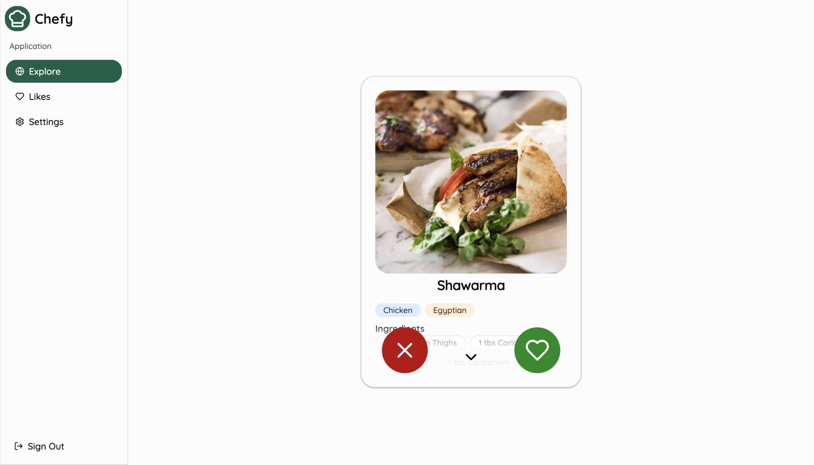
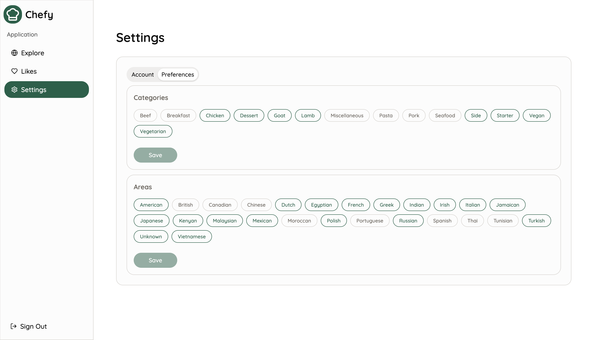

    
  <h1 align="center">Chefy</h3>
  

    An app that allows you to swipe and explore cooking recipes from around the world
  

  
  
  

## 📰 About the Project

Chefy is a modern web app built with Next.js (App Router) that helps users discover global recipes in a fun, swipeable interface. Save your favorites, customize your preferences, and even export recipes to PDF for offline use.

## 🔴 Live Demo

👉 [Click here to try Chefy](https://chefy-lm.vercel.app)

### 🔐 Test Credentials

You can check the app using test account:

- Email: **test@test.com**
- Password: **testtest**

Or simply sign up with your own credentials.

## ⚙️ Features

- ✅ User authentication
- ✅ Swipe and explore global recipes
- ✅ Save and manage liked recipes
- ✅ Export recipes to PDF
- ✅ Customize dietary preferences

## 🧑‍💻 Tech Stack

Built with:

## 📋 Upcoming Features

- 🌙 Dark Mode support
- 🌐 Internationalization (i18n)
- ➕ Add your own recipes

## 🗃️ Data Source

All recipe data is fetched from TheMealDB.
